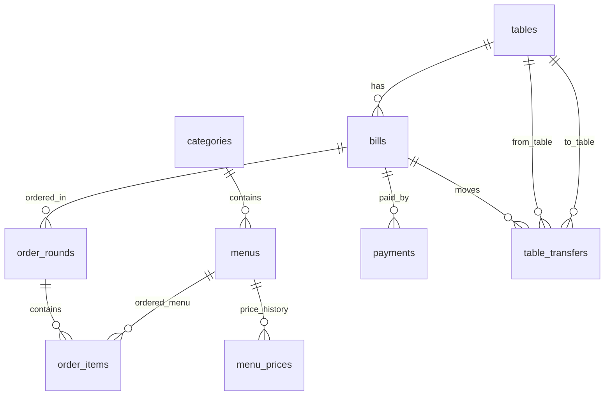

# เหตุผลฐานข้อมูลและหลักฐานดัชนี

## ความสัมพันธ์



แยกบิล รอบ และรายการอาหารเพื่อเก็บทุกครั้งที่สั่งเพิ่มโดยไม่เขียนทับรอบเดิม menu_prices เก็บประวัติราคาขาย ส่วน order_items.price_at_order เก็บราคาจำนวนเต็มตอนส่งออเดอร์ การเปลี่ยนราคาจึงไม่เปลี่ยนบิลหรือยอดขายเก่า payments แยกข้อมูลการรับเงินออกจากยอดรายการอาหาร

ON DELETE RESTRICT ป้องกันการลบเมนู/โต๊ะ/บิลที่ถูกอ้างถึงจนประวัติหาย การปิดขายใช้ flag แทนลบเมนู การ reset ลบตามลำดับ table_transfers → payments → order_items → order_rounds → bills ใน transaction เดียว

## ยอดบิล

```sql
SELECT COALESCE(SUM(oi.quantity * oi.price_at_order), 0) AS total
FROM order_rounds r
JOIN order_items oi ON oi.round_id = r.round_id
WHERE r.bill_id = ?;
```

JOIN รวมทุกรอบของบิล ใช้ราคาที่บันทึกตอนสั่ง SUM คำนวณใน SQLite และ COALESCE ทำให้บิลว่างมียอด 0

## ดัชนี

ผลจริงจาก SQLite ที่ตรวจด้วยชุดทดสอบชั่วคราวนอกโฟลเดอร์งาน:

```sql
EXPLAIN QUERY PLAN SELECT * FROM order_items WHERE status = ?;
-- SEARCH order_items USING INDEX idx_order_items_status (status=?)

EXPLAIN QUERY PLAN SELECT * FROM order_rounds WHERE created_at >= ?;
-- SEARCH order_rounds USING INDEX idx_order_rounds_created (created_at>?)
```

idx_order_items_status ลดการค้นรายการในสถานะที่ครัวต้องทำ; idx_order_rounds_created รองรับค้นรอบตามเวลา มีดัชนีเพิ่มบนเวลา order_items และเวลาปิดบิล รวมถึง unique indexes ป้องกันราคาปัจจุบันหลายรายการและบิลเปิดซ้ำโต๊ะ

## Transaction

ส่งหนึ่งรอบ: ตรวจบิลเปิด → สร้างรอบ → ตรวจเมนู/จำนวน → บันทึกทุกรายการ ถ้ามีรายการใดผิด rollback ทั้งรอบ

รับชำระ/ปิดบิล: ตรวจบิลและอาหารที่ยังไม่เสิร์ฟ → SQL รวมยอด/ยอดชำระ → รับยอดคงเหลือ → ปิดบิล เป็นหน่วยเดียว ป้องกันรับเงินซ้ำ

ย้ายโต๊ะและเปลี่ยนราคาก็ใช้ transaction เพื่อไม่ให้สถานะเปลี่ยนเพียงครึ่งหนึ่ง ทุก writer ในแอปใช้ queue เดียวต่อ connection; ใช้ withTransactionAsync บน SQLiteProvider connection ที่เปิด foreign_keys แล้ว ไม่เปิด connection เพิ่มในหน้าจอ

## ปัญหาที่พบจริง

1. React Native แสดง `undefined is not a function` และพิมพ์ error ไม่สำเร็จ: LogBoxData.js ใน node_modules ถูกเขียนทับด้วย ABillScreen; สำรองโค้ดแล้วคืนจาก react-native เวอร์ชันเดิม
2. Dependencies ที่ Router ดึงมาเลือก React DOM/worklets ไม่ตรงกับ React/Expo Go: ติดตั้ง react-dom, reanimated, worklets ผ่าน expo install ให้ตรง SDK และตรวจ expo install --check
3. ยอดบิลจากหน้าตัวอย่างรวมด้วย JavaScript และหน้าครัวมี SQL: ย้าย query เข้า db และคำนวณยอดด้วย SUM ตามโจทย์

รายงาน PDF ฉบับส่งจริงต้องให้สมาชิกอธิบายส่วนที่รับผิดชอบ พร้อมเพิ่ม PK/FK แบบละเอียด SQL ซับซ้อน 3 คำสั่ง สัดส่วนงาน และสิ่งที่จะทำต่ออย่างน้อย 3 ข้อ

## หน่วยเงินปัจจุบัน

ราคาและยอดชำระเป็นบาทจำนวนเต็ม เช่น 150 บาทเก็บ 150 ไม่รับทศนิยม เปิดฐานข้อมูลเดิมครั้งแรกจะแปลง menu_prices/order_items/payments จากสตางค์เป็นบาทภายใน transaction และใช้ PRAGMA user_version = 1 ป้องกันแปลงซ้ำ ไม่ใช้ app_meta หากข้อมูลเดิมมีเศษสตางค์ ระบบหยุดก่อนแปลงเพื่อไม่ตัดยอดทิ้ง
